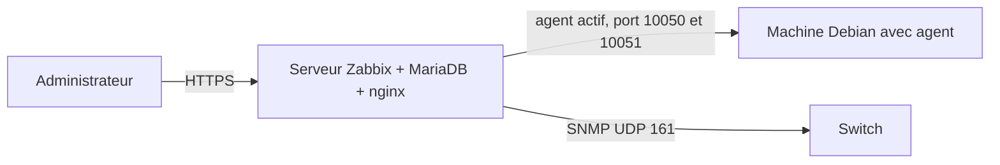

# Lab supervision : Zabbix, agent et SNMP

> **Statut : à réaliser.** Ce guide est préparé à partir de la documentation officielle et de mes cours ; **je ne l'ai pas encore rejoué de bout en bout**. Les commandes sont à valider en le faisant, et le journal en bas de page sera complété avec mes résultats réels (captures, erreurs rencontrées, corrections).

## Objectif

Mettre en place une **supervision** : un serveur Zabbix qui surveille des machines (processeur, mémoire, disque, services) et un équipement réseau (switch, via SNMP), et qui **déclenche une alerte** quand une valeur dépasse un seuil.

## Prérequis

- Deux machines virtuelles **Debian 12** sur le même réseau : le serveur Zabbix (2 Go de RAM minimum) et une machine à superviser.
- Un switch ou routeur configurable en SNMP (Packet Tracer ne convient pas : utiliser du matériel réel ou un routeur virtuel).
- Notions : SNMP, base de données MariaDB, serveur web.

## Topologie



## Étapes

> La procédure d'installation dépend de la **version de Zabbix** (7.0 LTS au moment de la rédaction). Les commandes de dépôt et les noms de paquets sont à prendre sur la page officielle de téléchargement, en choisissant Debian 12, MariaDB et nginx. Ce qui suit décrit les étapes et la configuration à vérifier.

### 1. Installer le serveur

1. Ajouter le dépôt officiel Zabbix (page « Download » du site officiel, paquet `zabbix-release`).
2. Installer : `zabbix-server-mysql`, `zabbix-frontend-php`, `zabbix-nginx-conf`, `zabbix-sql-scripts`, `zabbix-agent`, ainsi que `mariadb-server`.
3. Créer la base de données :

   ```sql
   CREATE DATABASE zabbix CHARACTER SET utf8mb4 COLLATE utf8mb4_bin;
   CREATE USER 'zabbix'@'localhost' IDENTIFIED BY 'mot-de-passe-long';
   GRANT ALL PRIVILEGES ON zabbix.* TO 'zabbix'@'localhost';
   SET GLOBAL log_bin_trust_function_creators = 1;
   ```

4. Importer le schéma :

   ```bash
   zcat /usr/share/zabbix-sql-scripts/mysql/server.sql.gz | mysql --default-character-set=utf8mb4 -uzabbix -p zabbix
   ```

   Puis remettre `SET GLOBAL log_bin_trust_function_creators = 0;`.
5. Renseigner le mot de passe dans `/etc/zabbix/zabbix_server.conf` (`DBPassword=`), démarrer et activer les services (`zabbix-server`, `zabbix-agent`, `nginx`, `php8.2-fpm`) et terminer l'assistant web.

### 2. Superviser une machine avec l'agent

Sur la machine à superviser : installer `zabbix-agent`, puis dans `/etc/zabbix/zabbix_agentd.conf` :

Fichier du dépôt : [`configs/zabbix_agentd.conf.extrait`](configs/zabbix_agentd.conf.extrait)

```text
Server=192.168.50.10
ServerActive=192.168.50.10
Hostname=machine-a-superviser
```

Redémarrer l'agent. Dans l'interface web : *Data collection → Hosts → Create host*, avec le même nom d'hôte, l'adresse de la machine, un groupe, et le modèle **Linux by Zabbix agent**.

### 3. Superviser un switch en SNMP

Sur un switch Cisco (SNMP v2c, lecture seule, **limité à l'adresse du serveur**) :

Fichier du dépôt : [`configs/switch-snmp.txt`](configs/switch-snmp.txt)

```text
access-list 20 permit host 192.168.50.10
snmp-server community LabSnmpRO ro 20
```

SNMP v2c transmet la communauté **en clair** : à réserver au laboratoire, et à remplacer par SNMPv3 (authentification et chiffrement) en production. Dans Zabbix : ajouter l'hôte avec une interface **SNMP**, la communauté, et un modèle comme **Cisco IOS by SNMP** (ou **Network Generic Device by SNMP**).

### 4. Provoquer une alerte

Sur la machine supervisée, saturer le processeur quelques minutes (`yes > /dev/null &` plusieurs fois, puis `killall yes`). Observer le déclencheur *High CPU utilization* dans *Monitoring → Problems*, puis sa résolution. Configurer une action de notification (courriel ou Telegram) pour recevoir l'alerte.

## Vérifications

- *Monitoring → Hosts* : les hôtes sont verts et la colonne « Availability » affiche ZBX/SNMP en vert.
- *Monitoring → Latest data* : des valeurs récentes (utilisation CPU, mémoire, trafic de l'interface).
- Sur le serveur : `sudo tail -f /var/log/zabbix/zabbix_server.log` sans erreur de connexion.
- `zabbix_get -s 192.168.50.20 -k system.cpu.load` (paquet `zabbix-get`) renvoie une valeur.
- `snmpwalk -v2c -c LabSnmpRO 192.168.50.2 sysDescr` (paquet `snmp`) renvoie la description du switch.

## Pièges fréquents

- Le pare-feu bloque les ports 10050 (agent) et 10051 (serveur) : l'hôte reste rouge.
- `Hostname` de l'agent différent du nom saisi dans l'interface.
- Jeu de caractères de la base incorrect (`utf8mb4` / `utf8mb4_bin` requis).
- Communauté SNMP ou liste d'accès (`access-list`) qui n'autorise pas l'adresse du serveur.

## Pour aller plus loin

- Créer un **tableau de bord** (disponibilité, trafic réseau) et un rapport mensuel.
- Ajouter une supervision web (page qui renvoie 200) et une surveillance du certificat TLS qui expire.
- Comparer avec une solution plus légère : [homelab-docker-services](https://github.com/mehdiseg/homelab-docker-services) (Uptime Kuma).

## Références

- [Téléchargement de Zabbix (dépôts par version)](https://www.zabbix.com/download)
- [Manuel de Zabbix](https://www.zabbix.com/documentation/current/en/manual)

## Journal de réalisation

_Lab pas encore réalisé : cette section sera remplie au fur et à mesure._

| Date | Ce que j'ai fait | Résultat | Difficultés et solutions |
|---|---|---|---|
|  |  |  |  |

## Feuille de route

Ce lab fait partie de ma [feuille de route réseau](https://github.com/mehdiseg/roadmap-reseau-bts-sio).

## Licence

[MIT](LICENSE)
